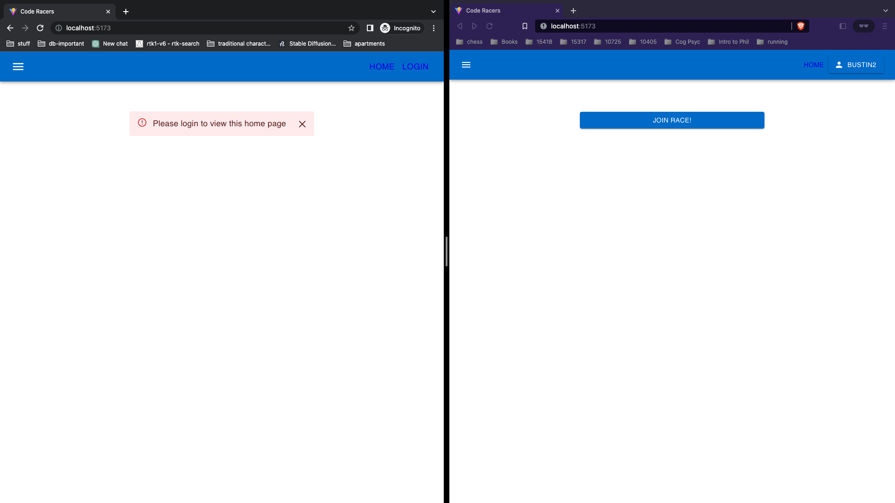
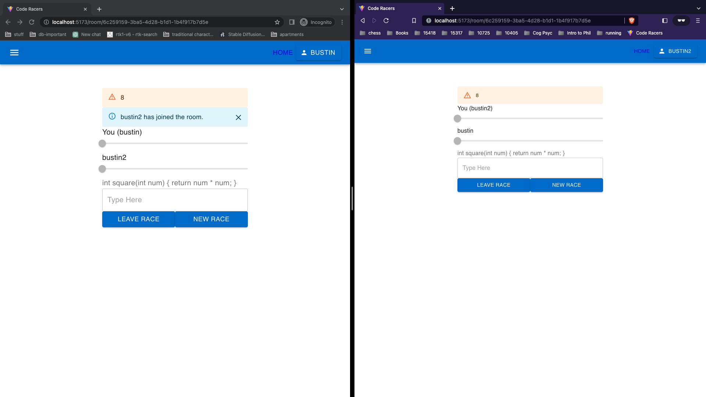
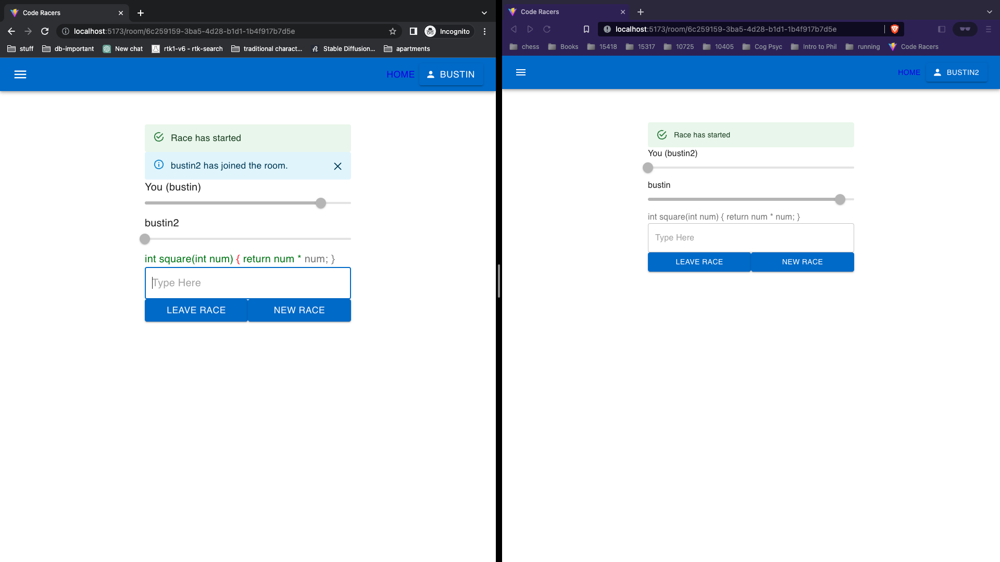

# my-code-racers
Real-time code racers using flask APIs, sockets, and databases. Supports custom user authentication using jwt token. needs more work

# Requirements
```
python3 -m venv venv 
source venv/bin/activate
pip install -r requirements
npm add @materials/ui
# there's more for npm, I just forgot to record
```

# How to run
Open up 2 terminals.
Launches node frontend
```
npm run dev
```
Launches flask backend
```
export MAIL_APP_USERNAME=your-email-username
export MAIL_APP_PASSWORD=your-email-password
npm run api
```
The `MAIL_APP_USERNAME` and `MAIL_APP_PASSWORD` are environment variables that enable email confirmation. Otherwise, you can go to config.py and change it yourself.

# Design
React is used as the frontend, and flask is used as the backend. Any request not in the domain of the frontend is sent to the backend. API requests are made to flask to authenticate the user. sqlite stores user information. Typing is done in realtime. Sockets are used to facilitate that. There is also email confirmation

# Perks
- Email confirmation on sign-up
- realtime server response 

# TODO
- Improve the error handling when client
  - refreshes the page.
  - leaves a race before the countdown and after the countdown
- Increase the capacity of rooms
- collect more code samples (through the webscraper that stills needs to get done)
- Analysis sentence structure and wpm, and store that information
- support '\n' or newline characters
- add codes to create rooms that users can join
- figure out deployment
- and many more bugs

# Examples

## Login


## Countdown


## Typing
